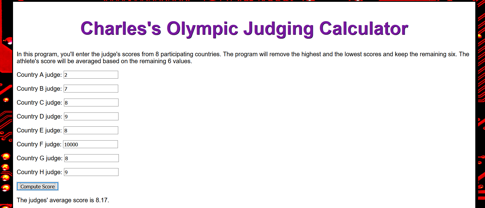

# OlympicJudges

## JavaScript App for calculating the average judge score

App takes user input for 8 Olympic judges, and then deletes the lowest and highest scores (due to a belief in judge's bias).  Then the app takes the remaining 6 scores and returns an average of those scores.  App is based on array logic, and has input validation.